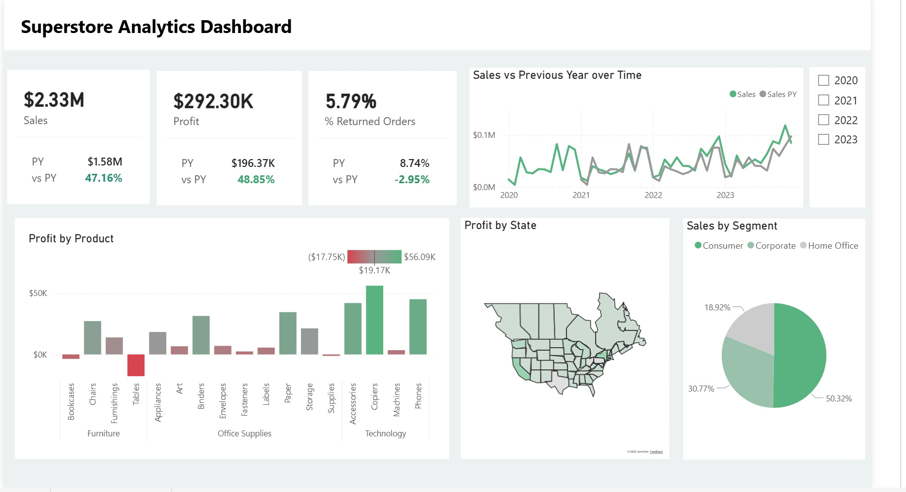

📊 Superstore Analytics Dashboard — Power BI
An end-to-end Business Intelligence project built in Microsoft Power BI, analysing retail sales performance across product categories, regions, and customer segments — including a 15-day sales forecast.

🗂️ Project Overview
This project covers the full BI development lifecycle — from raw data ingestion and cleaning, through data modelling and DAX measure development, to interactive dashboard design and sales forecasting.
DetailInfoToolMicrosoft Power BI DesktopDatasetSample Superstore Sales DataLevelBeginner – IntermediateProject TypeEnd-to-End BI DashboardReferenceYouTube Tutorial (2025)

📁 Repository Structure
📦 superstore-powerbi-dashboard
 ┣ 📊 Superstore_Dashboard.pbix       # Power BI project file
 ┣ 📄 superstore_data.csv             # Raw dataset used for the project
 ┣ 🖼️ dashboard-screenshot.png        # Preview image of the finished dashboard
 ┗ 📖 README.md                       # Project documentation (you are here)

🎯 Business Questions Answered
This dashboard was designed to help business stakeholders answer the following:

Which product categories are the most and least profitable?
Which regions generate the highest sales and profit?
What are the sales trends over time?
Which customer segments drive the most revenue?
What are the forecasted sales for the next 15 days?

🛠️ Steps Followed
1. Data Connection

Imported the Superstore CSV dataset into Power BI Desktop
Reviewed data structure — columns, data types, and row count

2. Data Cleaning (Power Query)

Removed null values and duplicate rows
Corrected data types (dates, numbers, text)
Created conditional columns where needed
Applied transformations and loaded clean data into the model

3. Data Modelling

Built relationships between tables
Verified the data model for accuracy before building visuals

4. DAX Measures
Key measures created using Data Analysis Expressions (DAX):
DAXTotal Sales = SUM(Orders[Sales])

Total Profit = SUM(Orders[Profit])

Profit Margin = DIVIDE([Total Profit], [Total Sales], 0)

Sales YOY Growth = 
    DIVIDE(
        [Total Sales] - CALCULATE([Total Sales], SAMEPERIODLASTYEAR('Date'[Date])),
        CALCULATE([Total Sales], SAMEPERIODLASTYEAR('Date'[Date])),
        0
    )
5. Dashboard Design
Interactive visuals built:

📌 KPI Cards — Total Sales, Total Profit, Total Orders, Profit Margin
📊 Bar Chart — Sales by Category and Sub-Category
🍩 Donut Chart — Sales by Customer Segment and Payment Mode
🗺️ Map Visual — Sales and Profit by Region/State
📈 Line Chart — Monthly Sales Trend with Forecast
🔲 Slicers — Region, Category, Year, Ship Mode filters

6. Sales Forecasting

Applied Power BI's built-in forecasting on the sales trend line chart
Generated a 15-day forward sales forecast based on historical data patterns

📸 Dashboard Preview

Show Image

💡 Key Insights

Technology is the highest revenue category but Office Supplies has the best profit margin
The West region leads in total sales; the South lags in profitability
Consumer segment accounts for the largest share of orders
Sales peak in Q4 (November–December) each year
The 15-day forecast indicates a continued upward trend in sales

🚀 How to Use This Project

Clone or download this repository
Open Superstore_Dashboard.pbix in Power BI Desktop (free download at powerbi.microsoft.com)
If prompted, refresh the data source and point it to superstore_data.csv
Explore the dashboard using the slicers and filters

🧰 Tools & Skills Used
SkillDetailsPower BI DesktopDashboard design and publishingPower QueryData cleaning and transformationDAXKPI measures and calculated columnsData ModellingTable relationships and schema designData VisualisationCharts, maps, KPI cards, slicersForecastingBuilt-in Power BI time series forecasting

🙋‍♂️ About Me
Microsoft Certified Power BI Data Analyst (PL-300) with a strong foundation in advanced data modeling, DAX, SQL, and Python-based predictive analytics. Experienced in delivering end-to-end analytics solutions and seeking opportunities in Data Analysis and Business Intelligence.

💼 LinkedIn — https://www.linkedin.com/in/godswill-douglas-055680221/
📧 Reach me at: godswilldouglas`117@gmail.com

If you found this project helpful, please ⭐ star the repo — it helps others find it!
